# Network Log Intelligence Platform

A two-server network-observability application that turns device syslog into a
searchable log archive, durable incident state, local-AI review, and an
operator-focused Grafana NOC queue.

**Working-system status:** operational. The public rebuild packages are
complete, although clean installation on two disposable servers was unavailable
and remains explicitly unverified rather than being represented as passed.
For the current production baseline, deferred work, and latest validation,
read [`docs/CURRENT_STATE.md`](docs/CURRENT_STATE.md).

## What this application does

The platform receives syslog from network equipment and keeps the original
records even when an event is unfamiliar. It then:

1. stores raw logs durably in ClickHouse
2. normalizes supported vendor messages without discarding unknown events
3. transfers verified observations to a separate GX10 inference host
4. correlates observations into deterministic incidents with stable identity,
   recurrence counts, and lifecycle state
5. uses a local Gemma model for bounded incident explanations and for a hidden,
   fail-closed review of important events not yet covered by deterministic rules
6. returns validated incident snapshots and AI results through a replay-protected
   write-only path
7. presents current work, noisy interface flaps, resolved history, and matching
   raw logs in Grafana

The system is an observability and incident-presentation platform. It is not an
automatic remediation system or an editable ticket database. Resolution is
driven by observed state, and the application does not make network changes.

## What the NOC operator sees

`AI Incident Analysis - Enhanced` is the operational queue:

- **Active Events** shows unresolved non-interface incidents. Recovered
  BGP/OSPF/OSPFv3 incidents—and one-observation protocol candidates that reach
  their qualification deadline—remain in `MONITORING` for 24 continuous
  healthy hours so a quick relapse reopens the same incident and increments its
  occurrence count.
- **Interface Flaps** shows a device/interface only after at least 10 exact
  interface-down transitions in the rolling preceding 60 minutes. Single downs,
  ports that remain down, and lower-rate reboot noise stay hidden. Rows leave
  automatically below the threshold.
- **Resolved Events** shows resolved non-interface incidents within the selected
  dashboard time range.

Every row supports search and read-only log investigation. One click opens a
compact Grafana Explore view scoped to the incident or to the rolling
device/interface window. A dedicated Viewer account is isolated in a NOC
organization containing only the approved dashboards and read-only datasource
copies. A one-minute playlist rotates between `NOC View` and the enhanced
incident dashboard.

The original `AI Incident Analysis` dashboard remains available as unchanged AI
assessment history and as a presentation fallback.

For exact queue semantics, read
[`docs/NOC_WORKFLOW.md`](docs/NOC_WORKFLOW.md).

## How it works

```mermaid
flowchart LR
    devices["Network devices"]
    operator["NOC operator"]

    subgraph collector["Collector / log server"]
        ingress["Vector syslog ingress"]
        raw["Raw ClickHouse logs"]
        backlog["Durable compressed backlog"]
        normalize["Deterministic normalizer<br/>and verified handoff"]
        gate["Validation, quarantine,<br/>and replay ledger"]
        results["Incident state and AI updates<br/>in ClickHouse"]
        grafana["Grafana NOC dashboards"]
    end

    subgraph gx10["GX10 / local inference host"]
        ingest["Read-only fetch and<br/>replay-safe ingest"]
        project["Canonical event projection"]
        incidents["Deterministic incident<br/>correlation and lifecycle"]
        select["Deterministic wake policy"]
        triage["Hidden uncovered-event triage<br/>through local Gemma"]
        assess["Selected incident assessment<br/>through local Gemma"]
        snapshot["Selective transactional<br/>outbox snapshot"]
        outbox["Lifecycle and AI-result outboxes"]
        sender["Bounded write-only sender"]
    end

    devices -->|syslog| ingress
    ingress --> raw
    ingress --> backlog
    backlog --> normalize
    normalize -->|verified read-only files| ingest
    ingest --> project
    project --> incidents
    project --> triage
    triage -->|validated positive only| incidents
    incidents --> select
    select --> assess
    incidents --> snapshot
    assess -->|structured assessment| snapshot
    snapshot --> outbox
    outbox --> sender
    sender -->|one file at a time| gate
    gate --> results
    raw --> grafana
    results --> grafana
    grafana --> operator
```



Plain-text equivalent:

```text
Network devices
      | syslog
      v
Collector: Vector -> raw ClickHouse
                  -> durable backlog -> normalizer -> verified handoff
                                                        | read-only
                                                        v
GX10: ingest -> canonical events -> deterministic incidents
                    |                    | selected assessment
                    | uncovered review   v
                    +-------> local Gemma model
                                         |
                         selective transactional snapshot
                                         |
                              lifecycle + AI-result outboxes
                                         |
                                  write-only sender
                                         |
                                         v
Collector: validation + replay ledger -> ClickHouse -> Grafana -> NOC operator
```

The collector is the durable system of record. GX10 owns compact working state,
correlation, and local inference, but it cannot write directly to ClickHouse.
Read-only observation transport and write-only result transport use independent
least-privilege identities.

The more detailed diagram, ownership model, and trust boundaries are in
[`docs/ARCHITECTURE.md`](docs/ARCHITECTURE.md).

## Role of AI

The LLM is deliberately bounded:

- deterministic code owns normalization, incident identity, lifecycle,
  recurrence, replay protection, and acceptance
- ordinary incident reasoning produces nonauthoritative structured explanations
- the hidden side channel reviews uncovered severity 0–4 events and only
  novel/repeated severity-5 notices
- an unavailable, timed-out, or invalid model leaves work pending and never
  creates an incident by failure
- a validated positive side-channel decision may admit an uncovered event as an
  ordinary `event_signature` incident; deterministic lifecycle owns it afterward
- automatically learned exact-event coverage is limited to severity 0–3 and
  requires three consistent confidence-70+ decisions spanning at least 30 minutes
- the model cannot modify devices, Grafana state, ClickHouse, or source logs

The pinned working model is `gemma4:latest`. A repeatable comparison retained it
over Nemotron 3.5 Lightning because Gemma followed the strict output and severity
contracts more reliably. See
[`docs/AI_DETECTION_SIDE_CHANNEL.md`](docs/AI_DETECTION_SIDE_CHANNEL.md) and
[`docs/LOCAL_REASONING.md`](docs/LOCAL_REASONING.md).

## Core design guarantees

- Capture first: legitimate observations are retained even when no parser
  recognizes them.
- Unknown and rare events remain reviewable instead of being silently dropped.
- Raw messages remain replayable.
- Collector arrival time is authoritative; device time is secondary metadata.
- Incident state is deterministic and survives dashboard time-range changes.
- Model failure is fail-closed and cannot invent successful work.
- Result acceptance is replay-protected and divergent same-name content is
  quarantined.
- Grafana is a projection, not the incident-state database.
- GX10 is replaceable and is not the authoritative raw-log archive.
- No production credential, private address, customer log, or private key is
  stored in this public repository.

## Main components

| Component | Responsibility | Source |
|---|---|---|
| Collector | Syslog ingress, raw retention, normalization, ClickHouse, Grafana, validation and replay protection | [`components/collector/README.md`](components/collector/README.md) |
| Normalizer | Deterministic vendor-aware event normalization with capture-first fallback | [`components/normalizer/README.md`](components/normalizer/README.md) |
| GX10 | Replay-safe ingest, canonical projection, deterministic incidents, local reasoning, side-channel triage, and result delivery | [`components/gx10/README.md`](components/gx10/README.md) |

Component and repository validation are versioned with the implementation.
Current verification status belongs in
[`docs/CURRENT_STATE.md`](docs/CURRENT_STATE.md); historical test counts and
deployment evidence remain in the append-only journal.

## Start here

For a new engineer or AI session, use this order:

1. [`docs/START_HERE.md`](docs/START_HERE.md)
2. [`docs/ARCHITECTURE.md`](docs/ARCHITECTURE.md)
3. [`docs/CURRENT_STATE.md`](docs/CURRENT_STATE.md)
4. [`docs/NOC_WORKFLOW.md`](docs/NOC_WORKFLOW.md)
5. [`components/collector/REBUILD_STATUS.md`](components/collector/REBUILD_STATUS.md)
   and [`components/gx10/REBUILD_STATUS.md`](components/gx10/REBUILD_STATUS.md)
6. the latest entries in
   [`docs/PROJECT_JOURNAL.md`](docs/PROJECT_JOURNAL.md)

`docs/CURRENT_STATE.md` is the execution authority. It contains exactly one
numbered `NEXT` while implementation work remains and none in the current
completed state.

## Repository guide

- [`docs/START_HERE.md`](docs/START_HERE.md) — recovery order and safety rules
- [`docs/ARCHITECTURE.md`](docs/ARCHITECTURE.md) — data flow, ownership, and trust boundaries
- [`docs/CURRENT_STATE.md`](docs/CURRENT_STATE.md) — authoritative current status
- [`docs/NOC_WORKFLOW.md`](docs/NOC_WORKFLOW.md) — operator queue behavior
- [`docs/OPERATIONS.md`](docs/OPERATIONS.md) — runtime behavior and failure handling
- [`docs/DATA_CONTRACTS.md`](docs/DATA_CONTRACTS.md) — raw, normalized, incident, and AI records
- [`docs/AI_DETECTION_SIDE_CHANNEL.md`](docs/AI_DETECTION_SIDE_CHANNEL.md) — uncovered-event AI review
- [`docs/GRAFANA.md`](docs/GRAFANA.md) — dashboards, access boundary, restore, and verification
- [`docs/TWO_SERVER_REBUILD.md`](docs/TWO_SERVER_REBUILD.md) — collector-first reconstruction
- [`docs/ACCEPTANCE.md`](docs/ACCEPTANCE.md) — passed evidence and waived clean-host boundary
- [`docs/DECISIONS.md`](docs/DECISIONS.md) — architecture decisions
- [`docs/ROADMAP.md`](docs/ROADMAP.md) — completed milestone sequence
- [`docs/PROJECT_JOURNAL.md`](docs/PROJECT_JOURNAL.md) — append-only engineering history
- [`docs/DOCUMENTATION_GUIDE.md`](docs/DOCUMENTATION_GUIDE.md) — documentation ownership and update rules
- [`components/README.md`](components/README.md) — component boundary map
- [`SECURITY.md`](SECURITY.md) — public-repository security policy

## Rebuild and security boundary

The repository is designed so two clean servers plus operator-supplied private
environment values are sufficient to reconstruct the system without relying on
conversation history. The public artifacts include implementation, guarded
installers, configuration templates, data contracts, runbooks, and independent
verifiers.

The full disposable two-server rebuild was not executed because suitable spare
systems were unavailable. The operator accepted that residual risk for project
sequencing; the missing empirical proof is still documented as waived and may
be completed later.

Never place passwords, API tokens, SSH private keys, production addresses,
private hostnames, customer/device-identifying logs, certificate private keys,
or generated runtime databases in this repository. Supply them through the
documented private operator inputs outside the checkout.
