# Architecture

## Purpose

The platform turns raw network telemetry into durable observations, deterministic normalized events, long-lived incident state, concise local-AI explanations, and fail-closed review of important deterministic coverage gaps without allowing the LLM to become the source of truth for identity or lifecycle.

The architecture is intentionally split across two roles: a durable collector/log server and a replaceable local-inference host named GX10.

## Application at a glance

Network devices send syslog to the collector. The collector preserves the raw records, normalizes a durable file backlog, and exposes only verified forward-going files to GX10. GX10 ingests those files into replay-safe local state and builds deterministic incidents. A hidden fail-closed side channel reviews important events not yet covered by deterministic rules and may admit only validated positives as ordinary incidents. Changed lifecycle snapshots feed the NOC queue directly, while separately selected incidents may ask the loopback-only local Gemma model for a structured explanation. Both record families return through one bounded write-only transport; the collector validates, deduplicates, and routes them to separate ClickHouse tables before Grafana presents them to an operator.

```mermaid
flowchart LR
    devices["Network devices"]
    operator["Operator"]

    subgraph collector["Collector / log server"]
        vector["Vector syslog ingress"]
        raw["Raw ClickHouse storage"]
        backlog["Durable compressed backlog"]
        normalizer["Deterministic normalizer<br/>and verified handoff"]
        gate["Result/lifecycle validation<br/>and replay ledger"]
        updates["Validated AI updates<br/>in ClickHouse"]
        lifecycle_store["Deterministic incident state<br/>in ClickHouse"]
        grafana["Grafana dashboards"]
    end

    subgraph gx10["GX10 / local inference"]
        ingest["Read-only fetch<br/>and replay-safe ingest"]
        projection["Canonical event projection"]
        incidents["Deterministic incident<br/>correlation and lifecycle"]
        uncovered["Uncovered-event selector"]
        wake["Deterministic wake policy<br/>and packet builder"]
        reasoning["Selected incident assessment<br/>through local Gemma"]
        triage["Hidden uncovered-event triage<br/>through local Gemma"]
        snapshot["Selective transactional<br/>outbox snapshot"]
        outbox["Validated AI result outbox"]
        lifecycle["Changed incident<br/>lifecycle outbox"]
        sender["Recurring one-file sender"]
    end

    devices -->|syslog| vector
    vector --> raw
    vector --> backlog
    backlog --> normalizer
    normalizer -->|read-only file transport| ingest
    ingest --> projection
    projection --> incidents
    projection --> uncovered
    incidents -.->|exclude existing incident evidence| uncovered
    uncovered -->|only no incident evidence| triage
    triage -->|validated positive only| incidents
    incidents --> wake
    wake -->|selected assessment only| reasoning
    incidents --> snapshot
    reasoning --> snapshot
    snapshot --> lifecycle
    snapshot --> outbox
    lifecycle --> sender
    outbox --> sender
    sender -->|write-only file transport| gate
    gate --> updates
    gate --> lifecycle_store
    raw --> grafana
    updates --> grafana
    lifecycle_store --> grafana
    grafana --> operator
```



Plain-text equivalent:

```text
Network devices
      | syslog
      v
Collector: Vector -> raw ClickHouse
                  -> durable backlog -> deterministic normalizer -> verified handoff
                                                                   |
                                                      read-only file transport
                                                                   v
GX10: replay-safe ingest -> canonical projection
                                  |
                                  v
                       deterministic incident engine
                         | deterministic wake policy
                         v
                    bounded reasoning packet
                         | selected assessment only
                         v
                    local Gemma model

              canonical projection -> uncovered-event selector
              incident evidence -- exclusion check -------^
                                      | only no incident evidence
                                      v
                    uncovered-event triage -> validated positive -> incident engine

                       selective transactional outbox snapshot
                                           |
                         lifecycle outbox + AI result outbox
                                           |
                                  recurring sender
                                              |
                                 write-only file transport
                                              v
Collector: validation + replay ledger -> incident state + AI updates -> Grafana -> operator
```

The deterministic layers own event identity, normalization, incident state, wake decisions, bounded packet construction, and replay safety. Only incidents selected by that wake/packet boundary reach ordinary local reasoning, where the LLM produces nonauthoritative explanation records. A separate fail-closed side channel may admit an otherwise uncovered important event only after a validated positive decision; it becomes an ordinary deterministic incident whose later lifecycle is not model-owned. The two file transports use independent least-privilege identities, and GX10 has no direct ClickHouse write path.

## Rebuildability contract

The current reconstruction/documentation effort is complete only when:

> Two application-clean compatible servers, this public repository,
> operator-supplied private deployment values, and the GX10 prerequisite
> artifact bundle named by `TWO_SERVER_REBUILD.md` are sufficient for another
> engineer or AI to reconstruct the current functional system without
> undocumented implementation memory.

The public repository therefore owns implementation logic, non-sensitive configuration, rebuild scripts, verifiers, data contracts, and operator instructions. Environment-specific identity and secrets remain operator-supplied at rebuild time. The externally provisioned GX10 kernel/driver/CUDA baseline, exact Ollama executable, offline model store, and pinned package sources are explicit rebuild inputs rather than repository-produced outputs.

This rebuildability contract does not require publishing production addresses, credentials, usernames, SSH keys, certificate private keys, firewall allowlists, customer-identifying data, or other private deployment identity.

## Component ownership

### Collector / log server

Owns:

- syslog ingress
- durable raw capture
- parsing and normalization
- ClickHouse storage
- Grafana presentation
- unknown-event inventory
- validation and storage of AI results
- validation and storage of deterministic incident lifecycle snapshots
- compressed durable backlog for GX10
- large and long-lived data stores
- service boundaries that protect durable storage from GX10

### GX10

Owns:

- receiving/fetching prepared or durable observation backlog
- compact local working state
- deterministic incident correlation
- repeat/burst accounting
- rolling incident context
- deciding when the local LLM should run
- local inference
- returning thin AI result records
- returning changed deterministic incident snapshots

GX10 is intentionally not the authoritative raw-log archive, dashboard server, or direct ClickHouse writer.

Current production has independent GX10 schedules for read-only backlog fetch and replay-safe local SQLite ingest, canonical projection and deterministic incident correlation, bounded packet creation and strict local-model invocation, selective transactional outbox snapshot/projection, and recurring result delivery. The snapshot isolates strict outbox readers from the mutable WAL database while retaining one consistent ten-table view. Reasoning results remain append-only and nonauthoritative. The sender uses a dedicated write-only collector identity and cannot access ClickHouse directly.

## Current data path

```text
Devices
  -> syslog ingress
  -> Vector
     -> ClickHouse raw store
     -> compressed durable backlog
        -> collector-side deterministic normalization
        -> verified forward-only handoff
           -> GX10 restricted read-only fetch
           -> local durable replay-safe ingest
           -> scheduled canonical projection
           -> deterministic incident correlation/lifecycle
           -> deterministic uncovered-event selection
           -> hidden fail-closed review of uncovered important events
           -> changed deterministic lifecycle outbox
           -> deterministic versioned reasoning packets
           -> bounded local inference through loopback Ollama
           -> append-only validated result outbox
           -> recurring write-only result sender
              -> collector validation/quarantine gate
              -> immutable acceptance ledger
              -> exclusive ClickHouse lifecycle and AI-update sinks
              -> Grafana
```

Ollama is installed, active, enabled, and loopback-only. Rediscovery found no historical application-specific caller or GX10 result producer; the repository therefore records the local caller, result outbox, and return sender as reconstructed additions rather than recovered historical behavior. Their protected activation, replay/conflict handling, natural recurring delivery, collector acceptance, ClickHouse provenance, and final conservation gates passed. Exact current operational evidence is maintained in `docs/CURRENT_STATE.md`, `docs/RESULT_OUTBOX.md`, `docs/RESULT_TRANSPORT.md`, and the latest `docs/PROJECT_JOURNAL.md` entries.

## Implemented target data path

The intended end-to-end architecture is now implemented on the working systems:

```text
collector capture
  -> collector-side deterministic normalization
  -> durable prepared observations
  -> GX10 deterministic incident correlation/lifecycle
  -> hidden AI review for deterministic coverage gaps
  -> deterministic wake policy
  -> local Ollama reasoning
  -> thin result producer
  -> collector write-only validation boundary
  -> ClickHouse/Grafana
```

The collector-side normalizer passed selected replay/parity, complete live shadow validation, and the production GX10 handoff gate. It remains a separate durable-file worker reading settled collector backlog files without changing Vector's raw sinks. A forward-only handoff view exposes only verified normalized outputs at or after an immutable floor while retaining the original GX10 transport identity. Raw and shadow histories and the exact raw-view rollback remain preserved.

After a multi-cadence stability review, the transitional GX10 vendor/message reparser was replaced by a canonical-field projector that preserves local suppression policy and historical enrichment evidence. The deterministic incident engine, wake-policy packet builder, versioned local caller, result outbox, and recurring sender each remain separately disableable. Result delivery crosses the collector's validation, quarantine, immutable replay-ledger, and ClickHouse ingestion boundaries before presentation. Final end-to-end production and repository closure passed; disposable clean-host execution remains explicitly waived and empirically unverified.

## Capture-first contract

The system captures legitimate observations before deciding whether they are understood. Unknown events are valid observations and remain attention-eligible by default.

Vendor/event decoders are enrichment modules. A parser mismatch or exception must not drop the raw event.

Suppression is narrowly defined: an explicit rule may prevent an event from waking the reasoning layer, but suppression never means deletion.

## Time contract

Collector arrival time is authoritative for event ordering. A device-supplied timestamp is retained separately when available.

## Incident model

Syslog records are observations. Incidents are persistent deterministic objects assembled from observations.

Lifecycle:

```text
CANDIDATE -> OPEN -> RECOVERING -> RESOLVED
```

The LLM may summarize or explain an incident but does not decide canonical identity, deduplication, or lifecycle state. The hidden uncovered-event side channel may create an ordinary generic incident only from a validated positive decision; deterministic correlation keys and lifecycle own the incident after admission, while unavailable or invalid inference remains pending without fail-open creation.

The long-lived deterministic incident engine is implemented and active behind a separately disableable offline schedule. Its identity, evidence, lifecycle, repeat, rolling-context, transaction, replay, and managed-invocation contracts are documented in `docs/INCIDENT_ENGINE.md` and `docs/MANAGED_CORRELATION.md`. The original fetch/ingest schedule remains independent.

## Context model

The incident engine builds deterministic compact summaries over approximately:

- 60 minutes
- 180 minutes
- 24 hours

Open incidents persist until resolved. Compact resolved history may remain available for substantially longer periods to improve operator context.

## LLM wake policy

Reasoning runs are event-driven and rate-limited rather than invoked for every record. Approximate intended behavior:

- periodic analysis when meaningful new evidence exists
- immediate wake for major/critical conditions
- interface flaps are valid wake reasons
- OSPF retransmission degradation is a valid wake reason

The exact policy remains deterministic and testable outside the LLM.

Uncovered important events follow a separate bounded selector. Severity 0–4
events and only novel/repeated severity-5 notices are eligible. The local model
returns `incident`, `ignore`, or `insufficient`; only validated positives enter
the ordinary incident engine. Learned exact-event coverage is restricted to
severity 0–3 and requires three consistent confidence-70+ decisions over at
least 30 minutes without contradiction. See
`docs/AI_DETECTION_SIDE_CHANNEL.md`.

## Trust boundaries

Input and output transport credentials are independent and least-privilege.

- backlog reader: read-only
- AI result writer boundary: a dedicated write-only GX10 sender identity, independent of the read-only backlog identity
- AI results: validated before durable ingestion
- GX10: no direct ClickHouse write path
- ClickHouse application listeners: collector-local boundary
- Grafana/collector rebuild secrets: operator-supplied, never embedded in public artifacts

## Dashboard restoration boundary

Grafana dashboard state is reconstructed through the supported Grafana resource API rather than by writing directly to Grafana's SQLite database.

Current captured dashboards use `dashboard.grafana.app/v2`. The rebuild path preserves captured dashboard `spec` content while allowing Grafana to generate server-owned metadata.

## Production migration rule

New deterministic parsing or correlation logic is built beside the current production path first. It is promoted only after fixtures, negative-path tests, replay, parity, idempotency, and explicit rollback planning are satisfactory.

Transitional logic is retired deliberately rather than rewritten in place without comparison.

## Reconstruction rule

Before adding new architecture to a component, first capture enough of the currently functional implementation that an application-clean compatible machine can reproduce it from this repository plus the documented private and external prerequisite inputs. This prevents modernization work from destroying the only known working implementation history.

Both component reconstruction packages and operator runbooks now satisfy the
repository-authored application-layer portion of that rule for the documented
input set. Full clean-host execution remains empirically unverified and was
explicitly waived by the operator for project sequencing because disposable
targets are unavailable. `docs/TWO_SERVER_REBUILD.md` defines the authoritative
inputs, cross-system order, and acceptance evidence.
